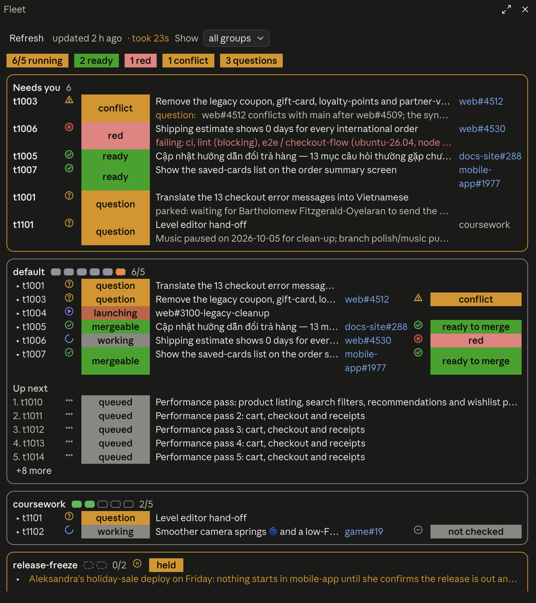

# claude-fleet

**Run five Claude Code sessions at once, and still know exactly what each one is doing.**



Queue the work, and fleet keeps five sessions busy: a freed slot gets the next task right away. A live board shows what needs you: a PR ready to merge, a red check, a conflict, a question.

## Why fleet

- **Delegate in one line.** Any session can hand off a task: `fleet enqueue --title "Fix the export timeout" --prompt-file task.md`.
- **Never idle, never stampeded.** At most five run at once. A finished, blocked or merged task frees its slot, and the next one in the queue takes it.
- **No collisions.** Fleet tracks which files every session has touched. When two overlap, they message each other before editing.
- **What needs you comes first.** A band above your prompt and a `/fleet-board` pane update every minute, and a toast pops when a PR turns green or red or a task asks you something.
- **Dependencies and holds.** Make a task wait for another task or a PR to merge, freeze one project during a release, or push one task to the front.
- **Hand over the dispatcher.** The brief, the task template and a daily journal live in the fleet, so a fresh session takes over the board in one command.

### "Can't I just open five sessions and tell each one to fix an issue?"

Sure, if you enjoy being the bottleneck. You'd be the one noticing which session finished, picking the next issue, checking who touched which file, and refreshing five PR pages to see what went green. Fleet does all of that while you're out to lunch, and pings you when it actually needs a human.

## Install

```bash
claude plugin marketplace add zAcherttp/claude-fleet
claude plugin install fleet@claude-fleet
```

Then ask Claude to *"fan these issues out in parallel"*, or open the board with `/fleet-board`.

Needs Node 18+, git and the GitHub CLI (`gh`) for PR status.

<details>
<summary>The terminal view</summary>

```
slots 4/5
NAME   TASK  KEY              STATE      BRANCH             PR     NET  FILES  OVERLAP
alder  t001  acme/api#1650    mergeable  claude/alder-3f1   #1731  −1   6      —
birch  t002  acme/api#1652    working    claude/birch-9c2   —      +2   3      src/routes/sessions.ts ← cedar
cedar  t003  acme/api#1655    working    claude/cedar-11a   —      —    2      src/routes/sessions.ts ← birch
dogw   t004  acme/web#88      question   claude/dogw-7d0    —      —    1      —
queue (2)
  1. t006 acme/api#1661 Fix the export timeout
  2. t007 acme/api#1664 Retry the webhook on 502
```

</details>

<details>
<summary>How it works</summary>

- `bin/fleet` keeps one JSON file per task in `~/.fleet`, written atomically under a lock that recovers from a crashed holder.
- `skills/fleet` teaches Claude when to enqueue, launch, join, report state and clean up after a merge.
- `hooks/register.tsx` is a Claude Code mod that draws the board. It reads the board and **one** batched GraphQL query for every PR (about a second), and shows "no access" for repos your `gh` account can't read.
- A task moves through `waiting → queued → launching → working → question | mergeable → verifying → done`. Only `launching` and `working` take a slot.

</details>

<details>
<summary>Tested</summary>

`fleet --self-test` runs 51 checks: the pool limit, queue order, held tasks, dependencies, locks, hand-over and six concurrent enqueues producing exactly one task. `claude plugin test .` runs 17 board tests on the terminal and the desktop at 36, 48 and 100 columns, including a worst-case board (`FLEET_BOARD_FIXTURES=1`, `/fleet-board worst`).

</details>

MIT licensed.
